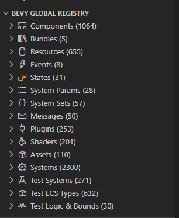
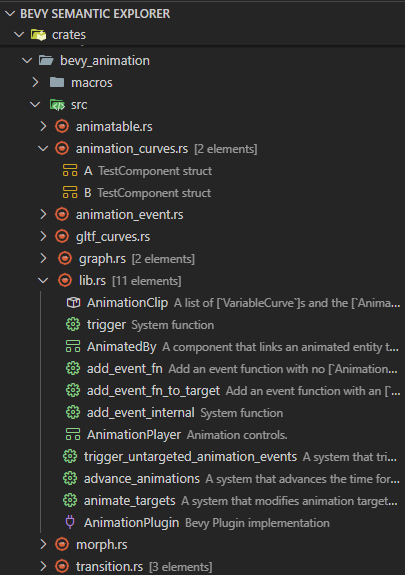
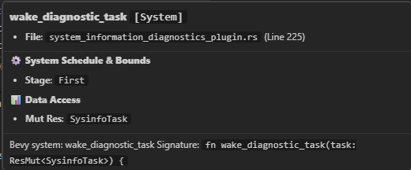

# Bevy Lens

**Bevy Lens** is a lightweight, high-performance VS Code extension designed specifically for the **Bevy Game Engine**. By statically analyzing your Rust codebase, WGSL/WESL shaders, Bevy Lens maps your ECS universe into a dedicated sidebar—drastically reducing cognitive load and helping you keep track of your game's systems, components, resources, states, and more.

Official Website: [BevyCN 中文社区](https://bevycn.com/)

---

## 🌟 Key Features

### 1. 🔍 Bevy Global Registry
Get a centralized, organized view of all Bevy types defined in your project:
*   **Structured Categories**: Automatically categorizes **Components**, **Resources**, **Events**, **States**, **Messages**, **Plugins**, **Shaders**, **Assets**, and **Systems**.
*   **Multi-crate & Workspace Hierarchies**: Groups your ECS registry by Cargo crates, mapping structures directly under their respective packages.
*   **Examples & Bins Sub-categorization**: Automatically isolates systems and types inside `examples/` and `src/bin/` into dedicated nested folders (e.g., `Example: ui/button`), ensuring that game logic and examples never clutter the core library tree.
*   **Test Code Separation**: Scours `mod tests` and `#[cfg(test)]` modules to isolate and group test components, test resources, and test systems (under dedicated "Test ECS Types", "Test Systems", etc.) to keep production environments clean.
*   **Fuzzy Search & Filtering**: Quickly filter down massive registries using positive (`Player`) and negative (`!Collision`) query selectors.
*   **Code Navigation**: Click any item in the tree view to instantly jump directly to its definition in the editor.

  

### 2. 📁 Semantic Workspace Explorer
An enhanced physical file explorer that reveals Bevy structures inline:
*   **Inline File AST**: Expand `.rs`, `.wgsl`, and `.wesl` files to see what Bevy concepts are defined inside them.
*   **Dynamic Synchronization**: Automatically reveals and focuses the active file in the sidebar explorer as you type or switch between tabs in your editor.
*   **Custom Brand Icons**: Instantly differentiate between components, systems, and assets using dedicated VS Code codicons matching your active icon theme.

  

### 3. 📝 Rich Previews, Shader Binding Bridge & Concurrency Diagnostics
*   **Instant Documentation**: Displays the first line of your Rust triple-slash (`///`) docstrings beside registry items. Hovering over any item reveals the full Markdown documentation.
*   **Shader Bridge & Entry Points**: Extracts `@binding` layouts (uniforms, textures, samplers) and registers entry points (`@vertex`, `@fragment`, `@compute`) including compute workgroup sizes (`@workgroup_size`), allowing seamless shader pipeline inspection.
*   **Parallel Query Write-Conflict Linter**: Statically checks systems registered in the same schedule phase. If two systems read/write to the same component/resource mutably without declared ordering (`.after()`, `.before()`, `.in_set()`), Bevy Lens flags it with a status indicator (🔴 / 🟡) and warns you of potential race conditions.

  

---

## ⚡ Requirements & Recommendations

*   **Rust & Bevy**: Projects built using Rust and the Bevy game engine.
*   **Rust Analyzer (Recommended)**: For live compilation error/warning badges in the tree views, it is highly recommended to install the official [Rust Analyzer](https://marketplace.visualstudio.com/items?itemName=rust-lang.rust-analyzer) extension.

---

## ⚙️ Extension Settings

This extension contributes the following settings:

*   `bevyLens.excludePaths`: An array of glob patterns to exclude from scanning (defaults to `["**/target/**", "**/.git/**"]`).
*   `bevyLens.enableConflictDiagnostics`: A boolean setting to enable static query read/write conflict warnings for parallel systems (defaults to `false`).

---

## 📅 Release Notes

### 0.1.12
*   Added **Change Sort Order...** command to the Global Registry title bar, allowing sorting Bevy elements alphabetically (A-Z) or by their file position.
*   Introduced `bevyLens.sortBy` configuration.

### 0.1.11
*   Fixed active editor synchronization highlight to correctly render the native focus selection background in Bevy Semantic Explorer.

### 0.1.10
*   Added **New File from Template...** command with 4 built-in Bevy templates (Plugin, System, ECS Types, WGSL Shader).
*   Optimized file tree nodes to utilize VS Code's active **File Icon Theme** natively.
*   Fixed a WSL/remote development bug where `Reveal in Explorer View` context menu command failed.
*   Significantly optimized workspace file traversal and TreeView diagnostics caching performance.

### 0.1.2
*   Support for cargo multi-crate workspaces.
*   Intelligent nested grouping for examples (`examples/`) and binaries (`src/bin/`), resolving down to individual files and folders.
*   Full support for compute shader (`@compute`) entry point extraction and workgroup size parsing.
*   Isolate test-scoped derived Bevy items and systems inside `mod tests` or `#[cfg(test)]` modules.

### 0.1.1
*   Support for `.wesl` (WebGPU Extended Shading Language) shader files.
*   Static write-conflict warnings and order checkers for parallel systems.
*   Expanded registry metadata, including schedule phases, system-sets, and data access signatures.

### 0.1.0
*   Initial release of Bevy Lens.
*   Support for Components, Resources, Events, States, Messages, Plugins, Shaders, Assets, and Systems.
*   LSP diagnostic synchronization.
*   Workspace bidirectional location tracking.

---

## 📄 License

This extension is licensed under the [MIT License](LICENSE).
